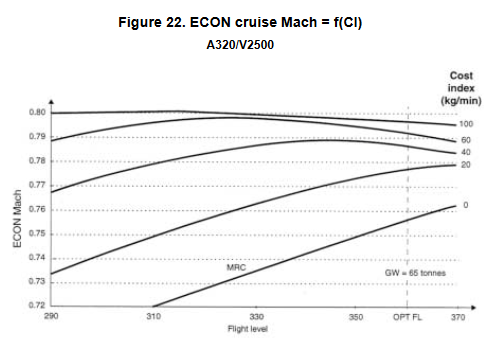
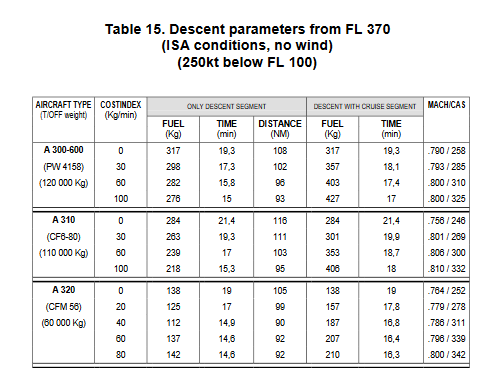
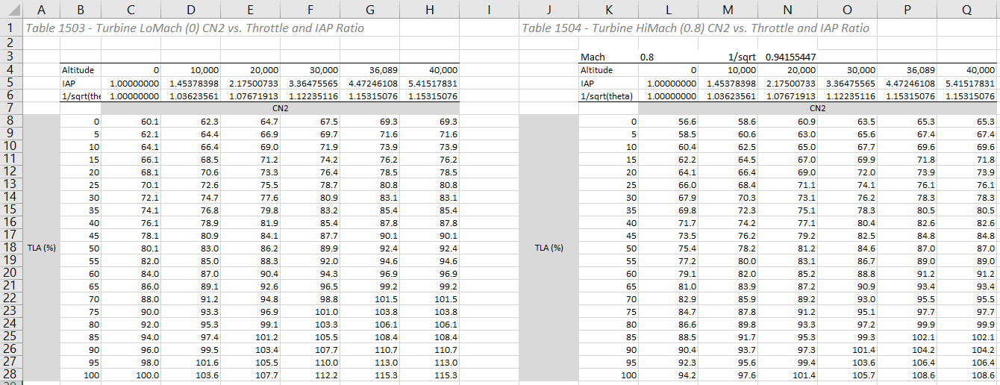
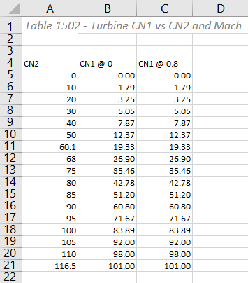
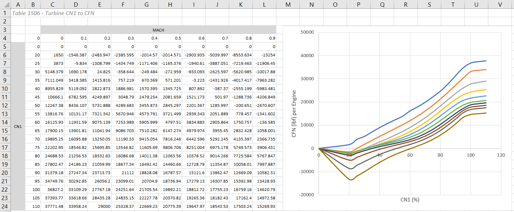
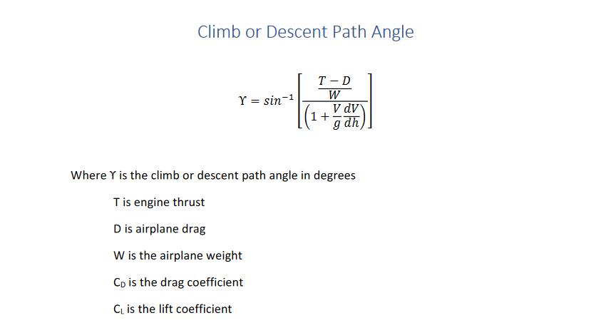
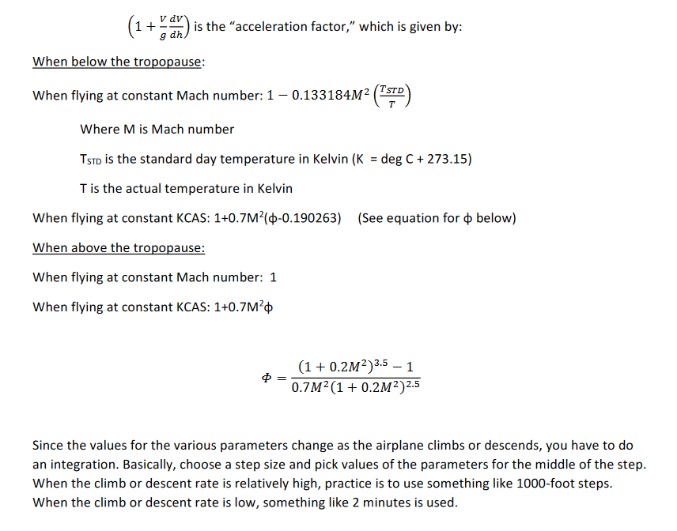
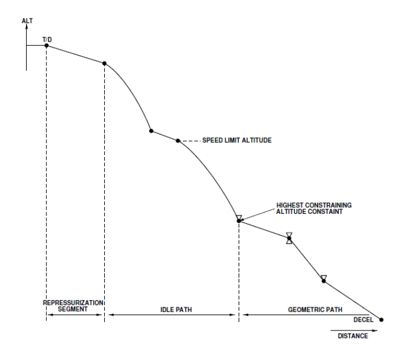
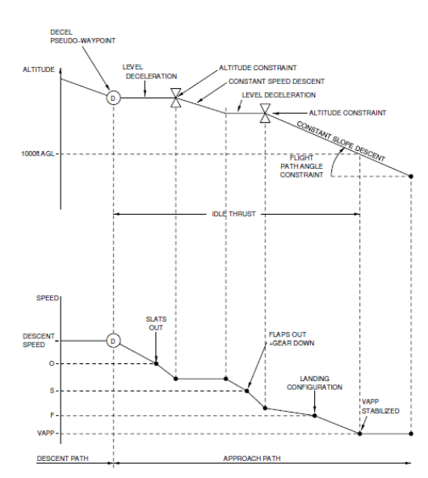

- Feature Name: vertical_navigation
- Start Date: 2021-01-04
- RFC PR: [flybywiresim/rfcs#9](https://github.com/flybywiresim/rfcs/pull/9)
- A32NX Issue: N/A

# Summary
[summary]: #summary

Implementation of full vertical navigation (managed speed & managed altitude modes), as present in the real Airbus A320neo.

# Motivation
[motivation]: #motivation

VNAV is a critical part of the A320's autopilot and is currently not implemented properly.

# Guide-level explanation
[guide-level-explanation]: #guide-level-explanation

The algorithm and calculations specified below are derived from real A320 references, and specify how to contruct and perform predictions on a vertical profile for the plane to fly when in managed altitude mode. The bulk of the work is done in the DESCENT phase, which requires separation into IDLE paths (descent at idle thrust, maintaining constant optimum descent speed with pitch), and GEOMETRIC paths (descent at a constant flight path angle and speed, with variable thrust) in order to satisfy speed and altitude constraints. Repressurization segments are ignored for now, until a comprehensive cabin pressure system is implemented.

# Reference-level explanation
[reference-level-explanation]: #reference-level-explanation

## **Data required**

- Aircraft
    - ZFWCG (to obtain CG)
    - ZFW (to obtain GW)
    - Current block fuel (to obtain GW)
    - Cruise flight level
    - Cost index
    - Idle engine thrust at various altitudes
    - Cabin rate (used for repressurization segment construction)
- Environment
    - Winds (for each waypoint)
    - QNH at destination (used to compute cabin rate)
    - Temp. at destination (used to compute delta ISA)
    - Temp. at cruise flight level
    - Tropopause altitude
- Flight plan
    - Speed limit (usually 250 kts/10,000 ft.)
    - Speed and altitude constraints
    - DECEL pseudo-waypoint location
    - Destination runway threshold altitude

## **Criteria for recalculation**

During recomputation, predictions are temporarily dashed on MCDU pages and pseudo-waypoints are temporarily removed from MCDU and ND

**Recalculation conditions:**

- Prior to descent:
    - Lateral flight plan
    - Vertical flight plan
    - Cost index
    - Descent forecast winds and cabin rate
    - Destination temperature, wind, and QNH
    - Descent MACH or CAS
- During descent:
    - Lateral flight plan modifications
    - Vertical flight plan modifications
    - Aircraft enters holding pattern
    - Aircraft reaches TOO STEEP path

Predictions are continually "refreshed" - no tempoary dashed line.

**Refresh conditions:**
- Theoretical path rebuilt
- Speed control mode changed
- HM fix overfly

## **Wind interpolation**

Calculations: TODO

## **Cost index**

Calculations: TODO




## **Optimum speed calculations**

**Speed lower limit**: maximum between minimum selectable speed (VLS) and green dot speed (VFTO).

**Speed upper limit**: smallest of VMAX (max selectable speed, 0.2g buffet margin), VMO-10 or MMO-0.02, and VMX CRZ (max speed held in level flight with max cruise thrust)

Climb, cruise, and descent speeds are optimized (within flight envelope) according to:

- Aircraft weight (GW)
- Aircraft center of gravity (CG)
- Cost index (CI)
- Cruise flight level
- Wind and temperature models

Climb optimum speed is a CAS/MACH pair which is frozen at transition to climb phase. It is updated if cost index, cruise flight level, or meteorological data are modified during climb.

Cruise optimum speed is optimized along the cruise, and is updated in real time according to the actual flight conditions. MACH above FL250, CAS below.

Descent optimum speed is a MACH/CAS pair which is frozen at transition to descent phase.

Go-around optimum speed is VFTO.

## **DECEL pseudo-waypoint computation**

*This is already computed, but need to confirm whether existing DECEL point calculations are accurate enough for our purposes.*

Vapp is held up to 1000 ft AGL in landing conf (above destination runway threshold) for precision approaches, and up to the final approach fix in landing conf for non-precision approaches. To compute the speed profile from Vapp, idle thrust is assumed with the right configuration to accelerate backwards to the descent speed, at which point DECEL is located. Constant altitude segments are assumed, whenever required, to in order to meet speed constraints.


## **Engine Model Calculations**

### Obtaining idle thrust

Based on TazX's engine model. Here is how to obtain idle thrust using tables and bilinear interpolation:

1. Using a TLA of 0 for idle thrust, first interpolate the altitude for both tables to obtain two CN2 values: one for mach 0, and one for mach 0.8. Then, interpolate between these two CN2 values based on the current mach.

    

2. Using the CN2 value from the last step, use the CN2 to CN1 table (interpolating the CN2 value) to obtain two CN1 values: one for mach 0, and one for mach 0.8. Then, interpolate between these two CN1 values based on the current mach.

    

3. Using the CN1 value from the last step, and the current mach, perform bilinear interpolation to get a thrust value in pounds of force. This is the idle thrust.

    


### Obtaining take-off and climb thrust

Similar process above, but only step 3 is needed - simply use the pre-computed TOGA or FLEX N1 to get take-off thrust, and the CLB N1 to get climb thrust.

## **Fuel burn prediction**

For now: use existing EFOB calculations to predict fuel burn between waypoints.

## **Flight model calculations**

### **flight_model.cfg definitions**

- ***Cd0***:  0.0237
- ***b*** (wing span): 117.5 ft.
- ***S*** (wing area): 1313.2 sq. ft.
- ***e*** (wing efficiency factor): 0.75

**Note:** When flaps/slats are deployed, the wing area is "increased" by the sim. Further investigation into this is required.

### **Coefficient of lift**

- Cl = Weight / (1481.4 x Mach² \* delta \* S)
    - Delta: the pressure at the altitude divided by the pressure at sea level
    - Note: 1481.4 constant is for weight in lbs and wing area in square feet

### **Coefficient of drag** (based on MSFS flight model eqns. & above definitions)

- **Base - clean config**: Cd = Cd0 + ((0.8\*Cl - Cl0)²)/((b²/S) * π * e)
    - Multiplication by 0.8 is necessary to adjust for the over-prediction of drag compared to the measured in-sim values
- **Speedbrake deflection**: +(0.035 * 0.66 * \<spoiler deflection percent simvar\>)
    - For some reason, max spoiler deflection is 66% instead of 100%, so the speedbrake component of drag coefficient must be multipled by 0.66
- **Gear extension**: +(0.045 * \<gear extension percent simvar\>)
- **Flaps**: +(0.046 + (f)(1.93)(1.85) + (s)(1.93))
    - 0.046 is the base drag for flaps
    - *f* is the flap angle in radians (e.g. 0.698 rad = 40 deg)
    - *s* is the slat angle in radians (e.g. 0.471 rad = 27 deg)

### **Idle segment FPA (flight path angle)**

Credit: @donstim




### **Idle deceleration distance**

- F = T - D
    - Force = thrust - drag

## **Algorithm for profile prediction**

### Climb
- Thrust reduced to MAX CLB at thrust reduction altitude.
- V2 + 10 knots targeted from takeoff until ACCELERATION ALTITUDE reached.
- Optimum climb is performed by holding max climb thrust (MAX CLB) and optimum climb speed.
    - Optimum climb speed is capped by SPD LIM when under specified altitude (usually 250 kts./10,000 ft.)
    - In the event of a speed constraint at a waypoint during climb, that speed restriction takes priority and is obeyed until the waypoint is passed.
- However, if said climb is above an AT or AT OR BELOW constraint, a level segment is inserted at the constraint altitude until the constraint point.
- There is no specific strategy for satisfying AT OR ABOVE constraints
- In the event of conflict between constraints, the first laterally encountered constraint has priority.
- TODO: Top of climb (ToC) prediction

### Cruise

- Cruise predictions are based on the aircraft flying level at the cruise altitude/flight level using the appropriate thrust to maintain optimum cruise speed.
- If a step climb or descent exists in the flight plan, it is taken into account in the cruise predictions.
    - Step descent: -1000 FPM (at step speed)
    - Step climb: Max climb thrust (at step speed)

### Descent



- From DECEL pseudo-waypoint moving backwards through the flight plan, find the first constraint waypoint which does not satisfy an idle path descent.

    - The descent profile **before** this waypoint (from ToD) is predicted as an IDLE path. The plane will descend at idle thrust, using pitch to maintain descent optimum speed.

    - The descent profile **after** this waypoint (until DECEL) is predicted as a GEOMETRIC path. The plane will descend at a fixed flight path angle (FPA) between waypoints in the geometric path in order to obey constraints.

    - Cabin repressurization segments are ignored for now.

- Without taking fuel burn into account yet, start at the waypoint at the end of the IDLE path. Looking backwards, use the "Idle segment FPA" formula above to give a rough first estimate for top-of-descent (ToD)
    - Calculate the estimated block fuel at ToD.

    - Moving forwards through the flight plan until end of IDLE path in fixed-distance steps (e.g. 5nm), performing calculations at each step with updated gross weight, wind, and altitude figures (as well as optimum speed and other constant factors), integrate position to find the distance until the aircraft will reach the first waypoint constraint it must obey (the altitude of the waypoint which divides the IDLE and GEOMETRIC paths). 

        - If the SPD LIM occurs during the IDLE path (or there is a speed constraint at a waypoint), perform the necessary calculations using the "Idle deceleration distance" formula so that the aircraft meets this restriction.
        
            - **NOTE**: Some documents indicate that deceleration to meet SPD LIM is a continuous decelerating descent, whereas all other deceleration in the descent/approach (such as at a DECEL waypoint), are level segment decelerations.

    - Find the distance error between the predicted end of idle segment (the waypoint), and the actual end of idle segment (the position the previous calculation ended at when meeting the altitude constraint).

    - Adjust the ToD position as a function of distance error calculated in the previous step. 

    - Repeat these last four steps until the distance error is minimized or below a certain threshold. Prefer errors in which the aircraft meets the altitude constraint **before** the waypoint. Incorporate an upper limit to number of iterations.

- Once a satisfactory ToD and IDLE path calculation is performed, we now have an accurate fuel (and GW) figure for the beginning of the GEOMETRIC path.

    - For each segment between two waypoints with applicable altitude constraints, perform the following steps:

        - Create a flight path angle between the waypoints as a function of distance and altitude difference.

        - If there is a speed constraint at the ending waypoint, calculate the distance needed to decelerate using the "Idle deceleration distance" formula, and adjust the flight path angle to be steeper, so it ends in time to perform level flight for the calculated deceleration distance before the ending waypoint.

        - Taking aircraft characteristics (including fuel burn affecting GW during the segment), distance, altitude, and meteorological conditions (especially wind), calculate whether the aicraft will be able to meet the ending waypoint's altitude constraint (+/- 250 feet), with half spoilers extended.

            - TODO: derive formula for this

        - If the aircraft is unable to meet the altitude constraint at the end of this segment, a "TOO STEEP PATH AHEAD" message will appear on the MCDU up to 150 nm prior to the segment (and TOO STEEP PATH marker on ND). The aircraft will still attempt to fly the profile during this segment (most likely at idle thrust), but will not obey this constraint, instead attempting to target the next altitude constraint.

### Approach

- Approach profile is calculated from 50 feet above the destination runway threshold backwards to the DECEL point.
- Constant speed, idle thrust segments are constructed for level change between altitude constraints, unless a flight path angle is specified.
- Vapp is held from runway threshold + 50 feet up to 1,000ft AGL.



# Pseudo-Waypoints

## MCDU & ND

- **(T/C)**
- **(T/D)**
- **(SPD LIM)**
- **(DECEL)**

## ND ONLY

- **Level-off (climb)**: same as (T/C) if FCU altitude matches cruise altitude. Otherwise, indicates cruise altitude or altitude restriction level-off.
- **Level-off (descent)**: FCU altitude or altitude restriction level-off.
- **Start of climb**: appears after AT or AT OR BELOW altitude constraint during climb.
- **Start of descent**: same as (T/D) if current altitude matches cruise altitude. Otherwise, appears after AT or AT OR ABOVE altitude constraint during descent.
- **Intercept point**: where the aircraft will intercept the descent profile (either from above or below).

# Pseudocode

## FLIGHT MODEL FUNCTIONS
```
getLiftCoefficient() {
    // placeholder
}

getDragCoefficient() {
    // placeholder
}

getDrag() {
    // placeholder
}
```

## ENGINE & FUEL MODEL FUNCTIONS
```
getIdleThrust(mach, altitude) {
    // placeholder
}

getClimbThrust(climb_n1) {
    // placeholder
}

getFuelBurn(distance, deltaAltitude, initialSpeed, finalSpeed, thrust) {
    switch(thrust):
        case thrust.IDLE:
            // placeholder
            break;
        case thrust.CLIMB:
            // placeholder
            break;
        case thrust.VARIABLE:
            // placeholder
            break;
    end switch;
}
```

## VNAV UTILITY FUNCTIONS
```
calculateFPAfromThrust(thrust, speed, distance, ...) {
    // Used in climb and idle segment calculations
}

calculateDeltaSpeedDistance(verticalSpeed, initialSpeed, finalSpeed, ...) {
    // Used for calculating distance to accel/decel
}

canAchieveGeometricSegment(flightPathAngle, distance, speed, ...) {
    // Placeholder
}
```


## LATERAL FUNCTIONS
```
distanceToWaypoint(currentPos, waypoint, ...) {
    // Placeholder
}

distanceBetweenWaypoints(waypoint1, waypoint2, ...) {
    // Placeholder
}
```


## VERTICAL PROFILE
```
class VerticalProfile {
    descentProfile() {
        // CONTRUCTOR TODO
        this._destination = undefined;
        this._upcomingWaypoint = undefined;
        this._previousWaypoint = undefined;

        this._altitudeDeviation = undefined;
        this._commandedFPA = undefined;

        this._topOfClimb = undefined;
        this._topOfDescent = undefined;
        this._speedLimit = undefined;
        this._decelPoint = undefined;

        this._finalAppFix = undefined;
        this._finalGlidePathAngle = undefined;
    }

    calculateStartOfClimb() {
        // Placeholder
    }

    calculateEndOfClimb() {
        if currentPhase < CLIMB:
            return;
        endif;

        if fcu.altitude < fmgc.cruiseAltitude:
            climbTargetAlt = fcu.altitude;
        else
            climbTargetAlt = fmgc.cruiseAltitude;
        endif;
    }

    calculateStartOfDescent() {
        // Placeholder
    }

    calculateEndOfDescent() {
        if fcu.altitude > fmgc.finalApproachFixAlt:
            descentTargetAlt = fcu.altitude;
        else:
            descentTargetAlt = null;
        endif;
    }
    
    calculateInterceptPoint() {
        // Placeholder
    }


    initialize() {
        // Run once at beginning
    }

    update() {
        // Update self waypoint and position data here

        switch(fmgcFlightPhase):
            case PREFLIGHT:
            case TAKEOFF:
            case CLIMB:
                updateClimbPredictions();
                updateTocPseudo();
            case CRUISE:
            case DESCENT:
                updateDescentPredictions();
                updateSpdLimPseudo();
                updateTodPseudo();
            case APPROACH:
                updateApproachPredictions();
                updateDecelPseudo();
                break;
            case DONE:
                break;
        end switch;
    }

    updateClimbPredictions() {
        // Check if recalculation necessary
    }
    updateDescentPredictions() {
        // Check if recalculation necessary
    }
    updateApproachPredictions() {
        // Check if recalculation necessary
    }


    updateDecelPseudo() {
        // Call this function to update pseudo-waypoint
    }
    updateSpdLimPseudo() {
        // Call this function to update pseudo-waypoint
    }
    updateTocPseudo() {
        // Call this function to update pseudo-waypoint
    }
    updateTodPseudo() {
        // Call this function to update pseudo-waypoint
    }
}

```

# Drawbacks
[drawbacks]: #drawbacks

None, aside from development time and complexity.

# Rationale and alternatives
[rationale-and-alternatives]: #rationale-and-alternatives

- No alternatives, as VNAV is a necessary feature to implement to accurately simulate an Airbus.

# Unresolved questions
[unresolved-questions]: #unresolved-questions

None at the moment.

# Future possibilities
[future-possibilities]: #future-possibilities

Implement a CDA (continuous descent approach) algorithm and implementation in the future (including flaps 1 and 2 pseudo-waypoints), as present in real-world Honeywell FMS 2's.
